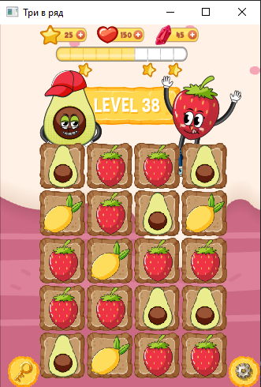

## Описание проекта:  

**В учебных целях разрабатывается игра "Три в ряд".**  

## Правила Игры:  

**Для хода делаем клик левой кнопкой мыши по ячейке поля - она подсвечивается, затем правой кнопкой мыши выбираем рядом стояющую ячейку для смены ячеек поля местами.
Если появилось 3 одинаковых ячейки поля в строке или столбце, они исчезают, и появляются новые ячейки поля.**  

### Графическое изображение игры:  
  

### Важно!:  
**Игра все ещё в разработке**  
В основном принципе, игра работет, но ведётся активная обработка ошибок и улучшение кода программы.  

## Проект собирается с помощью CMake  